# Block Contract

Block contract is to build decentralized contract that people can sign, view and trust. To protect the privacy, the content of the contract will *NOT* be hosted in the blockchain, *only the hash* of the content is store in the chain.

## High level design

The prototype of the flow of the app looks like this:

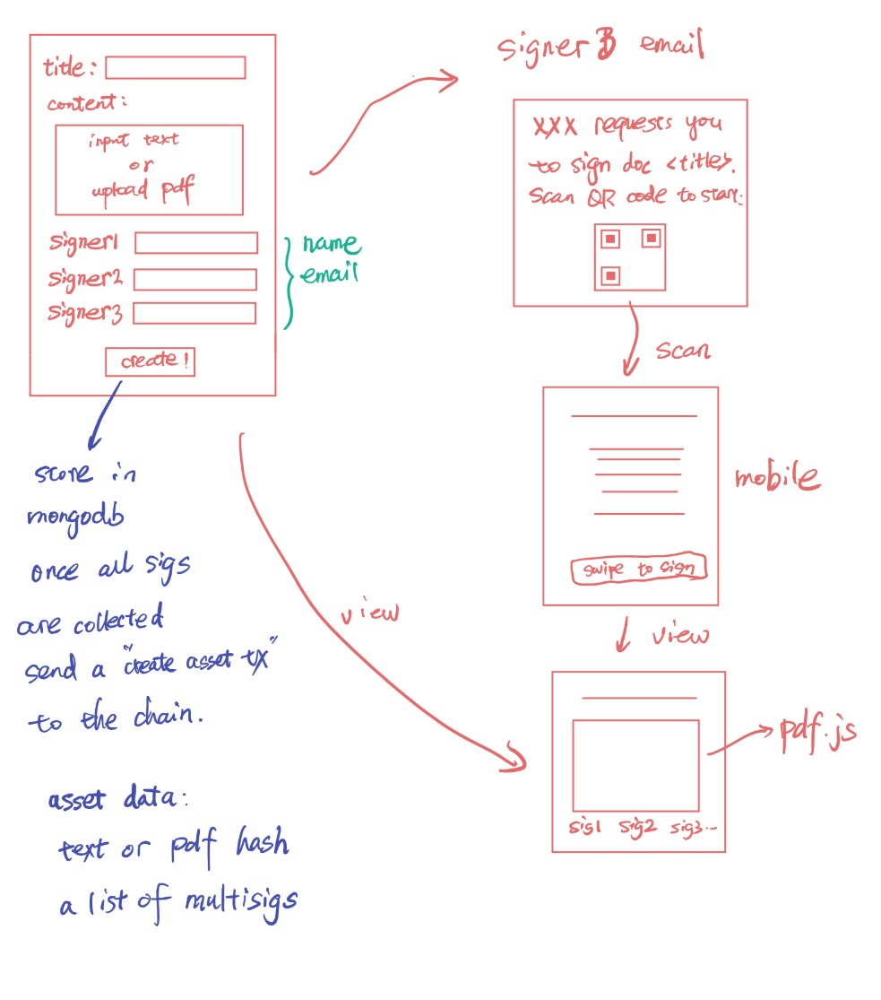

## Contract Templates

[Accord Project](https://www.accordproject.org) is a great open source tool to generate legal contracts.  The ultimate goal is integrate this project with Accord [Legal Contract Template Studio](https://studio.accordproject.org).

## Blockchain

We will use ArcBlock's Blockchain Framework to build a custom blockchain for this project's demo.  The block explorer lives here: [Block Contract Block Explorer](https://contract.abtnetwork.io/dashboard)

It's possible to use other blockchains, such as Ethereum, Bitcoin to record the contract through Open Chain Access Protocol (OCAP), but it will be limited in features.

## DB schema for contract

For contract created by the user, we store it as the following schema in mongo:

```javascript
const ContractSchema = new mongoose.Schema({
  // the did is calculated by sha3(concat(content, hash, signatures list without each sig))
  _id: { type: String, required: true, trim: true },
  requester: {type: String, required: true, trim: true},
  synopsis: { type: String, required: true, trim: true },
  content: { type: Buffer, required: true },
  hash: { type: String, required: true },
  signatures: [{
    name: { type: String, required: true, trim: true },
    email: { type: String, required: true, trim: true },
    signedAt: { type: Date },
    signature: { type: Buffer }
  }],
  finished: { type: Boolean, default: false},
  address: { type: String, default: '' },
  createdAt: { type: Date },
  updatedAt: { type: Date },
});
```

## Run this project from Repo

### Requirements

- Node.js v10+

### Get code and install dependencies

```bash
cd block-contract
make dep
node tools/declare.js
```

### Prepare the configuration

Before running the app, you need to put a `.env` file into your repo:

```bash
cat > .env
SKIP_PREFLIGHT_CHECK=true

DATA_DIR=".data"
APP_TOKEN_SECRET="c196792a8a14be2d3f10646079001a37e634ebbd99643c543f"
APP_TOKEN_TTL="1d"
APP_PORT="3030"
APP_SK="0x4848947cc88b2e83682dec00e681d9ca057c582c0bc9fd42a1ce6c386361d2bda24f683f458bad332b2c913fd374493b08aca1993f2640cbfccd962951c220c0"
APP_ID="zNKaoF3y3MiDHkisK2Dt8FgGVY6dXP6XETQr"

CHAIN_ID="playground"
CHAIN_HOST="https://playground.network.arcblockio.cn/api"

REACT_APP_APP_NAME="Block Contract"
REACT_APP_APP_DESCRIPTION="A decentralized contract platform that people can sign, view and trust"
REACT_APP_BASE_URL="http://192.168.1.2:3030"
REACT_APP_API_PREFIX=""

MAILGUN_USER="<your mailgun user>"
MAILGUN_PASSWORD="<your mailgun password>"
```

Note that you need to put your gmail user/pass and tune the BASE_URL here.

Make sure that you have your cellphone installed [ABT Wallet](https://abtwallet.io/en/) and it is under the same WIFI as your laptop running the app. Then:

### Start the Block Contract app

```bash
make run
```

## Screen Shots

Pages are being added so screen shots will be gradually available:

### The home page

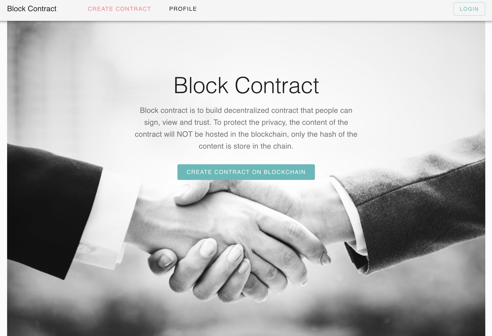

### Step 1: Scan QR code to login (provided by Forge React Starter kit)

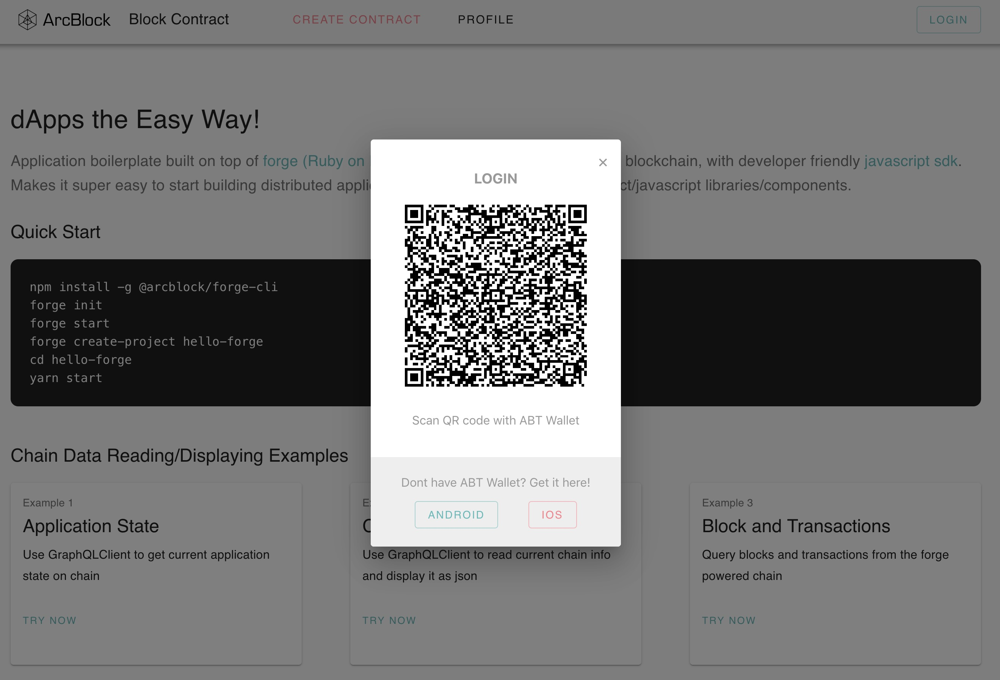

After you scanned the QR code with ABT wallet:

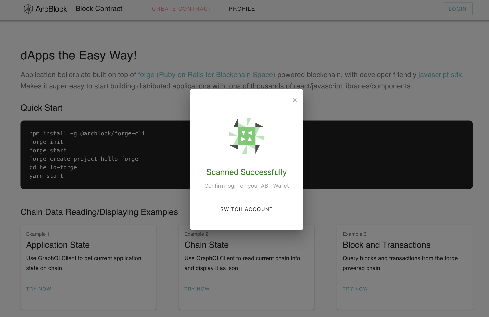

Then you are redirect to profile page. User can see the existing contracts:

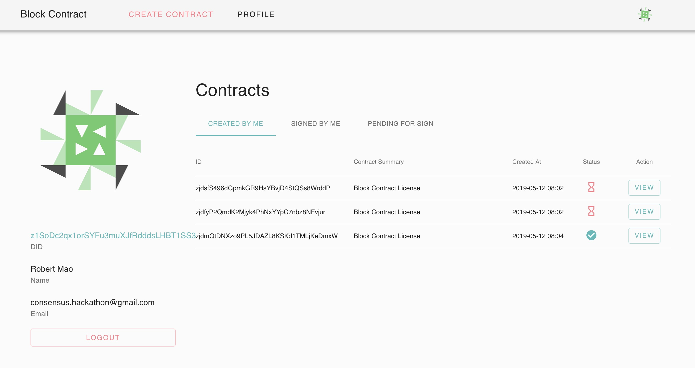

### Step 2: Create a new contract

You may want to create a new contract:

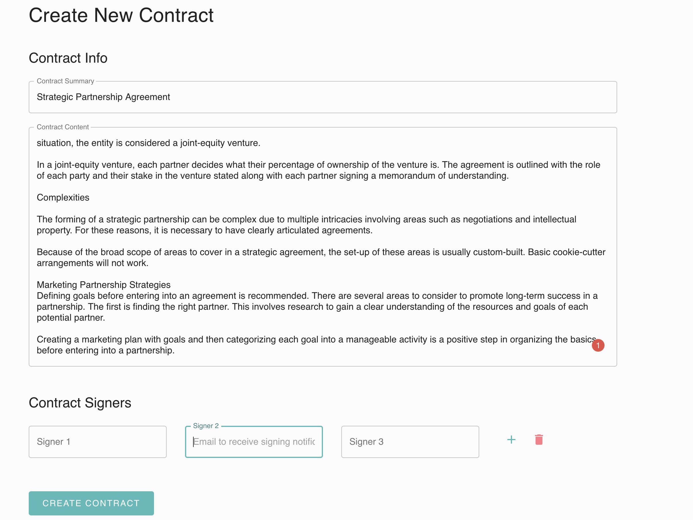

And all the signers will go emails like this:

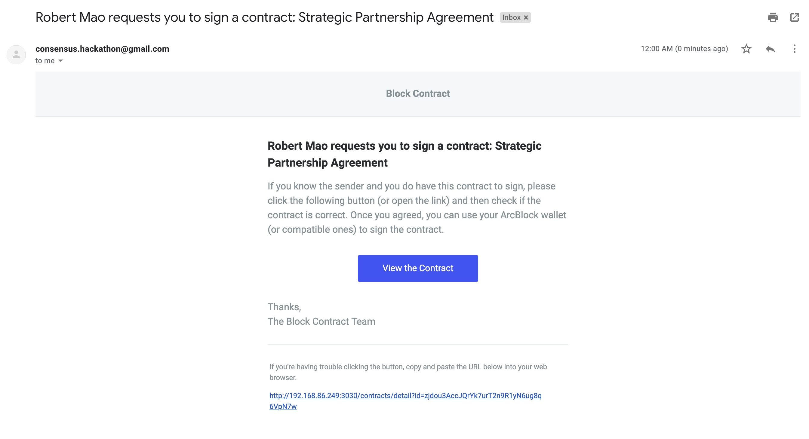

### Step 3 (for signer): Sign the contract

As a signer, when you got the email, if you click the "View the Contract" button or the link, you will get:

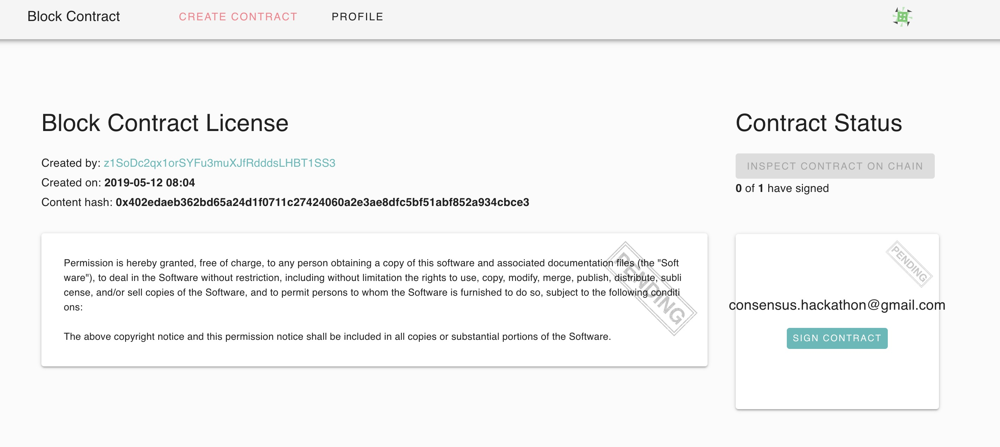

Then scan the QR code with the wallet app:

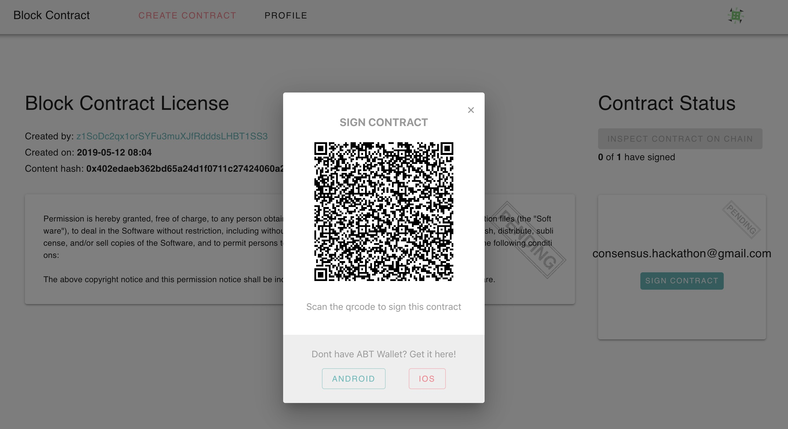

Once accepted, you signature will be put into the agreement. If all parties finished signing, the doc is signed:

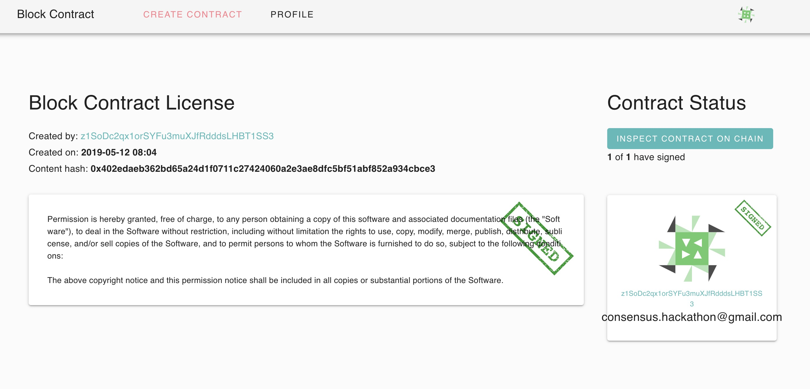

### Step 4 (anyone): Verify the contract in the chain

Then anyone can check the signatures on the chain:

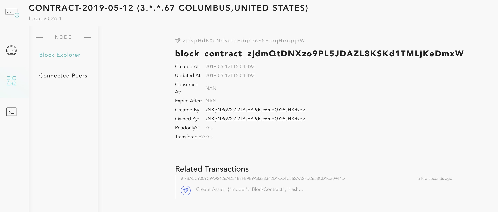

We could make this view much better later on.
